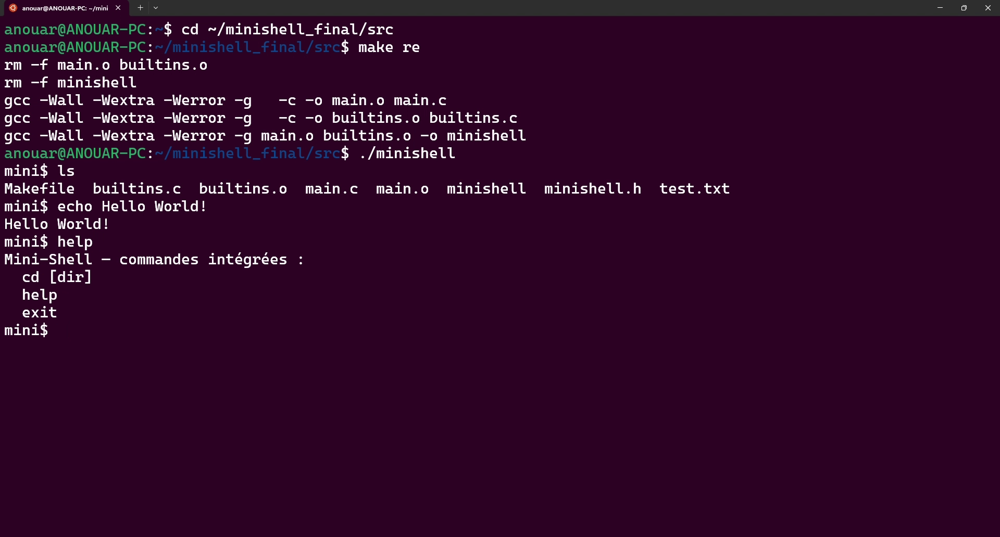

# MiniShell – Projet C

Un mini-shell simple écrit en langage C, permettant d'exécuter des commandes internes et externes, avec gestion des redirections, des variables d’environnement et du signal `Ctrl+C`.

---

## 📁 Structure du projet

```
minishell_final/
├── src/         → Code source (C, Makefile)
├── docs/        → Rapport PDF, vidéo, README
```

---

## ▶️ Compilation et lancement

```bash
cd src
make
./minishell
```

---

## 🎥 Démonstration

Voir la vidéo dans [`docs/demo.mp4`](docs/demo.mp4)  
La démonstration montre l’utilisation du shell avec différentes commandes et redirections.

---

## 🧠 Ce que j’ai appris

- Manipuler des processus (`fork`, `exec`, `wait`)
- Gérer les signaux sous Linux (`SIGINT`)
- Lire dynamiquement une ligne utilisateur
- Implémenter une logique de parsing simple
- Organiser un projet avec Makefile et Git

---

## ⚠️ Limites & améliorations futures

- Pas encore de support pour les pipes (`|`)
- Pas de gestion des guillemets `" "` ou des jokers `*`
- Possibilité d’ajouter l’historique de commandes

---

## ✅ Conclusion

Ce projet m’a permis de comprendre les bases de l’interprétation de commandes sous Unix/Linux.  
Il m’a appris à manipuler bas niveau des processus et à structurer un projet C proprement.
